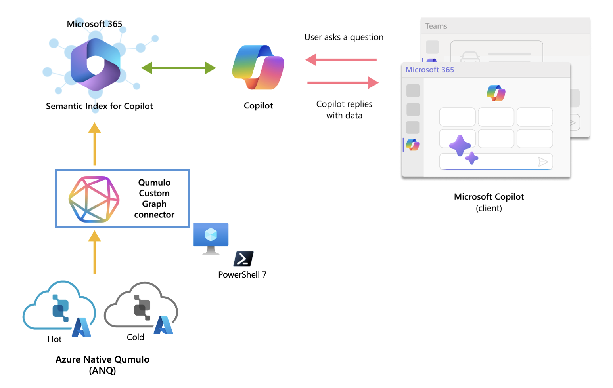

# Qumulo Custom Connector



## Overview
In the world of enterprise services, managing vast amounts of digital records scattered across various locations—on-premises, in the cloud, and in archives—is a common challenge. These records come in myriad formats, including databases, PDF files, Office documents, and text files, potentially scaling up to billions of documents. Traditional tools often fall short as they typically handle only structured data, and there are genuine concerns about security and competitive data leakage with some AI solutions.

The Qumulo Custom Graph Connector leverages Microsoft Graph Connectors in combination with Microsoft Copilot, providing a secure, scalable solution to scan, read, and index vast quantities of unstructured data directly from Azure Native Qumulo (ANQ) services. This integration facilitates the utilization of these files within the Microsoft 365 ecosystem without the need for data migration or reformatting, maintaining all data securely within the Azure perimeter.

This PowerShell-based Microsoft Custom Graph Connector enables the integration of data from Qumulo file storage for Microsoft Copilot. It primarily focuses on reading PDF documents stored in Qumulo, extracting specified data from these documents, and importing this data as external items into Microsoft Graph for indexing and searching.

## Requirements
- [PowerShell 7.0](https://learn.microsoft.com/en-us/powershell/scripting/install/installing-powershell?view=powershell-7.4) or higher
- [Microsoft Graph PowerShell SDK](https://learn.microsoft.com/en-us/powershell/microsoftgraph/installation?view=graph-powershell-1.0)
- [Xpdf tools](https://dl.xpdfreader.com/xpdf-tools-win-4.05.zip) (for PDF to text conversion)
- Access to a Qumulo cluster over SMB

## Configuration Files
### qumulo.json: ### 

This JSON configuration file contains details about the Qumulo cluster, specifying the address, share name, file prefix, and the temporary path for storing intermediate text file outputs. Here's a detailed look at each field:

`clusterAddress:` Address of the Qumulo cluster, e.g., anq.qumulo.com.

`shareName:` Name of the shared folder from which files will be read, e.g., invoices.

`filePrefix:` Pattern to match files of interest, here targeting files with the prefix "*.pdf", which likely denotes invoices in pdf files.

`tempFilePath:` Local path where the text extracted from PDFs is temporarily stored, e.g., C:\Invoice_Temp.txt. Don't forget to put an additional \ before any escaping character. 

``` json
{
    "clusterAddress" : "anq.qumulo.com",
    "shareName" : "invoices",
    "filePrefix" : "*.pdf",
    "tempFilePath" : "C:\\Invoice_Temp.txt"
}
```

### connection.json: ### 

This file contains configuration necessary for creating and describing an external connection within Microsoft Graph:

`userId:` Identifier of the user for whom the connection is set up.

`connection:` Details of the connection such as id, name, and description.
- `id:` Unique identifier for the connection, QumuloPowerShell5.
- `name:` Descriptive name of the connection, Invoice Data on Qumulo.
- `description:` Brief about what data the connection deals with.

`activitySettings:` Settings related to how the data is accessed and indexed.
- `baseUrl:` Base URL for the files, indicating they are accessed directly from the Qumulo cluster.
- `urlPattern:` Regex pattern to identify and process files based on their names.
- `itemId:` Template for constructing unique identifiers for items based on their names.

`searchSettings:` Settings pertaining to how search results are formatted and displayed.
- `id:` Identifier for the search result template.
- `layoutFilePath:` Path to the file defining the layout of search results. Don't forget to put an additional \ before any escaping character. 

``` json
{
    "userId" : "71608eb0-9c49-4a21-a77b-f8f3d66d4289",
    "connection" :{
        "id" : "QumuloPS5",
        "name" : "Invoice Data on Qumulo",
        "description" : "Invoice data including products, amounts, and customer details"
    },
    "activitySettings" : {
        "baseUrl" : "file://anq.qumulo.com/invoices/",
        "urlPattern" : "/Invoice(?<invoiceNumber>[^/]+).pdf",
        "itemId" : "{invoiceNumber}"
    },
    "searchSettings":{
        "id" : "invoiceTemplate",
        "layoutFilePath" : ".\\resultLayout.json" 
    }
}
```

### resultLayout.json ###
This file specifies the layout of search results displayed in the Microsoft Graph after data has been imported using the Qumulo Custom Graph Connector.

``` json
{
  "type": "AdaptiveCard",
  "version": "1.3",
  "body": [
    {
      "type": "TextBlock",
      "text": "Invoice Number: [${invoiceNumber}](${url})",
      "weight": "Bolder",
      "size": "Medium"
    },
    {
      "type": "TextBlock",
      "text": "Customer: ${customer}",
      "weight": "Bolder",
      "size": "Medium"
    },
    {
      "type": "ColumnSet",
      "columns": [
        {
          "type": "Column",
          "width": "auto",
          "items": [
            {
              "type": "TextBlock",
              "text": "Date: ${date}",
              "wrap": true
            },
            {
              "type": "TextBlock",
              "text": "City: ${city}",
              "wrap": true
            },
            {
              "type": "TextBlock",
              "text": "Country: ${country}",
              "wrap": true
            },
            {
              "type": "TextBlock",
              "text": "Post Code: ${postcode}",
              "wrap": true
            },
            {
              "type": "TextBlock",
              "text": "Total Amount: ${totalAmount}",
              "wrap": true
            },
            {
              "type": "TextBlock",
              "text": "Address: ${address}",
              "wrap": true
            }
          ]
        }
      ]
    }
  ],
  "$schema": "http://adaptivecards.io/schemas/adaptive-card.json",
  "$data": {
    "invoiceNumber": "100234",
    "customer": "Ana Heath",
    "totalAmount": "175.00",
    "date": "04/04/2024",
    "city": "Burmantofts",
    "country": "England",
    "postcode": "LS10 1RR",
    "address": "10 High Street"
  }
}
```

### schema.json: ### 
This file describes the schema for data to be indexed in Microsoft Graph.

For more information about a [schema](https://learn.microsoft.com/en-us/graph/api/resources/externalconnectors-property?view=graph-rest-1.0&preserve-view=true) property definition for a Microsoft Search connection.

``` json
[
    {
    "name": "customer",
    "type": "String",
    "isQueryable": true,
    "isSearchable": true,
    "isRetrievable": true
    },
    {
    "name": "totalAmount",
    "type": "String",
    "isQueryable": true,
    "isSearchable": true,
    "isRetrievable": true
    },
    {
    "name": "city",
    "type": "String",
    "isQueryable": true,
    "isSearchable": true,
    "isRetrievable": true
    },
    {
    "name": "country",
    "type": "String",
    "isQueryable": true,
    "isSearchable": true,
    "isRetrievable": true
    },
    {
    "name": "postcode",
    "type": "String",
    "isQueryable": true,
    "isSearchable": true,
    "isRetrievable": true
    },
    {
    "name": "address",
    "type": "String",
    "isQueryable": true,
    "isSearchable": true,
    "isRetrievable": true
    },
    {
    "name": "invoiceNumber",
    "type": "String",
    "isQueryable": true,
    "isSearchable": true,
    "isRetrievable": true
    },
    {
    "name": "date",
    "type": "DateTime",
    "isQueryable": true,
    "isRetrievable": true
    },
    {
    "name": "url",
    "type": "String",
    "isRetrievable": true
    }
]
```


## Functions

## Usage
1. Ensure all prerequisite software and PowerShell modules are installed.
> [!NOTE]
> PowerShell 7 is mandatory. Please don't forget to install it first.
   - Set an exceptional policy for running unsigned modules:
   ```powershell
   Set-ExecutionPolicy Unrestricted -Scope CurrentUser -Force
   ```
   - Install the required modules:
   ``` powershell
   Install-Module Microsoft.Graph -Scope CurrentUser -Force
   Install-Module -Name Microsoft.PowerShell.SecretManagement -Repository PSGallery -Force
   Install-Module -Name Microsoft.PowerShell.SecretStore -Repository PSGallery -Force
   ```
   - Register the SecretStore vault as the default vault:
   ```powershell
   Register-SecretVault -Name QumuloSecret -ModuleName Microsoft.PowerShell.SecretStore -DefaultVault
   ```
3. Connect your Qumulo cluster using Windows File Explorer.
   ```powershell
    \\YOUR_CLUSTER_NAME\SHARE_NAME
   ```
4. Install Xpdf
   - To install this binary package, copy everything to the recommended installation directory
   ```powershell
    C:/Program Files/Xpdf
   ```
5. Configure the JSON files (`qumulo.json`, `connection.json`) with appropriate values.
    - To configure the `qumulo.json`, update the below fields.
    ```json
    "clusterAddress" : "YOUR_CLUSTER_ADDRESS",
    "shareName" : "SHARE_NAME",
    "tempFilePath" : "ACCESSIBLE_PATH_FOR_TEMPORARY_FILE"
    ```
    - To configure the `connection.json`, update the below fields.
    ```json
    "connection" :{
        "id" : "UNIQUE_CONNECTION_ID",
        "name" : "UNIQUE_CONNECTION_NAME",
        "description" : "Invoice data including products, amounts, and customer details"
    },
    "activitySettings" : {
        "baseUrl" : "file://CLUSTER_ADDRESS/SHARE_NAME/",
    ```
    - For testing purpose please use our sample PDF files. Configuring the `resultLayout.json` and `schema.json` files is required for testing. 
6. Run the PowerShell script.
   ```cmd
   .\QumuloCustomConnector.ps1
   ```
7. Use the interactive menu to operate the functionalities of the connector. You can follow the order.
   ```cmd
   ================ Welcome to Qumulo Custom Connector! ================
   Please choose an option:
   - Press '1' to initialize an Entra app.
   - Press '2' to connect to a connection.
   - Press '3' to create a new connection.
   - Press '4' to import data from a Qumulo cluster.
   - Press 'Q' to quit.
   ====================================================================
   Select an option:
   ```
## Notes
- It's crucial to have proper permissions set up both in your Qumulo cluster and in Microsoft Graph to allow data reading and writing.

## Conclusion
This connector simplifies the process of importing data from Qumulo into Microsoft Graph, facilitating efficient data searches and better integration with Microsoft Copilot.
